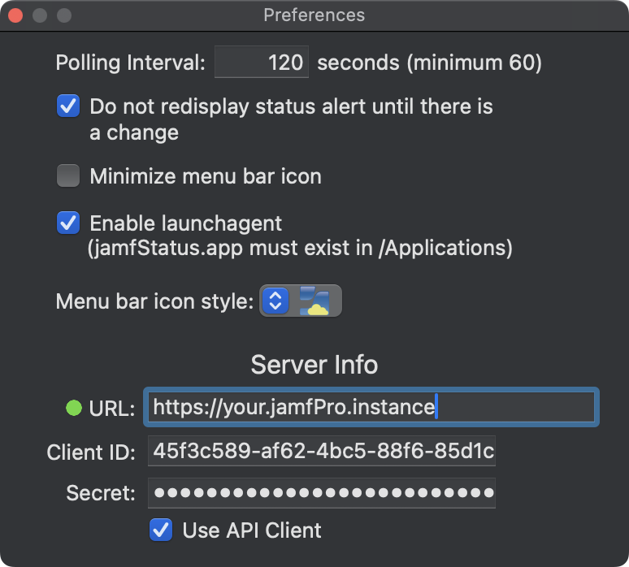
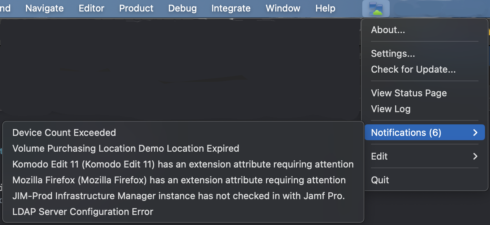

# jamfStatus
Download: [jamfStatus](https://github.com/jamf/jamfStatus/releases/latest/download/jamfStatus.zip)

The application submits basic hardware, OS, and jamfStatus application usage to [TelemetryDeck](https://telemetrydeck.com) by default. The data is sent anonymously and can be disabled by clicking 'Opt out of analytics' from the About window.

Keep an eye on the status of Jamf Cloud with jamfStatus.  The app will place an icon in the menu bar to reflect the current cloud status.


<p>
An alert window will be displayed as the cloud status changes.  You can configure how the alert window display refreshes, either at every status check or only when the status changes.

For minor Jamf Cloud issues something similar to the following be displayed.


For major Jamf Cloud issues something similar to the following be displayed.


Access Preferences from the menu bar icon.  Here you'll be able to set the following:<br>
- Polling interval.<br>
- Whether the alert window is displayed at every polling interval or only when the status changes.<br>
- How the menubar icon is displayed.  Minimizing will place a thin transparent icon in the menubar.<br>
- Use of a LaunchAgent, to automatically start the app when logging in.<br>
- Information for your specific Jamf Cloud instance. Use either a local user account or API client.  Keyboard shortcuts for copy/paste do not function, however you can right-click a field to paste URL, username, API client...<br>
- Most notification can be viewed using an account with no permissions set in Jamf Pro.  Using an account with ready-only on all objects ensure you'll see all notifications. If your cloud server does not utilize the standard HTTPS port (443) be sure to include the port you use in the URL.

<br>

There are two different menu bar icon styles to choose from.  One uses colors to indicate the status and the other uses slashes.<br><br>
            <div style="margin-left: 55px;">
               <table>
                  <tr>
                    <th>Status</th>
                    <td>minor</td>
                    <td>major</td>
                    <td>minor</td>
                    <td>major</td>
                  </tr>
                  <tr>
                    <th>Icon</th>
                    <td></th>
                     <td></th>
                        <td></th>
                           <td></th>
                  </tr>
                </table></div><br>

Notifications, if any, will appear after the next polling cycle once the information has been entered.



The health status can also be viewed for Jamf Cloud hosted instances. The status displays the percent of incoming requests that are successful.


Status changes are logged to ~/Library/Logs/jamfStatus/jamfStatus.log.  Once the log exceeds 5MB it will be zipped and a new log will be created.  A maximum of 10 zipped log files are retained.  Sample log data:

```
Thu Sep 17 20:24:30 Jamf Cloud Critical Issue Alert
Thu Sep 17 20:24:30 Please be aware there is a major issue that may affect your Jamf Cloud instance.
Thu Sep 17 20:24:30    eu-central-1: JCDS: Major Outage
Thu Sep 17 20:24:30    Jamf Cloud Distribution Service (JCDS): Major Outage

Thu Sep 17 20:25:30 Jamf Cloud Minor Issue Alert
Thu Sep 17 20:25:30 Please be aware there is a minor issue that may affect your Jamf Cloud instance.
Thu Sep 17 20:25:30    Compute Services - US: Degraded Performance
Thu Sep 17 20:25:30    Database Services - US: Degraded Performance

Thu Sep 17 20:27:30 Notice
Thu Sep 17 20:27:30 Jamf Cloud: All systems go.
```

## Notifications for the following will be displayed:

* &lt;certType&gt; Certificate Expired
* Cloud Identity Provider Certificate Expired
* &lt;certType&gt; Certificate Expiring in &lt;days&gt; days
* Cloud Identity Provider Certificate Expiring in &lt;validDays&gt; Days
* Scripts contain invalid references to /usr/sbin/jamf
* Extension attributes contain invalid references to /usr/sbin/jamf
* Policies contain invalid references to /usr/sbin/jamf
* Multiple policies have a management account password configuration that is not recommended
* A policy has a management account password configuration that is not recommended
* A configured management account feature is not recommended
* Volume Purchasing Location &lt;name&gt; Expiring In &lt;days&gt; days
* Volume Purchasing Location &lt;name&gt; Expired
* Volume Purchasing Server Token Revoked for the location &lt;name&gt;
* Automated Device Enrollment Instance &lt;name&gt; Expiring In &lt;days&gt; days
* Automated Device Enrollment Instance &lt;name&gt; Expired
* PreStage imaging and Autorun imaging requires a Jamf Pro user account with the Use PreStage Imaging and Autorun Imaging privilege.
* &lt;name&gt; updates inventory on all computers at recurring check-in. This may cause stability issues.
* &lt;softwareTitleName&gt; v&lt;latestVersion&gt; is available
* &lt;softwareTitleName&gt; has an extension attribute requiring attention
* Device Enrollment instance out of date with Apple’s Terms and Conditions.
* Sync failed. The associated Automated Device Enrollment instance is out of date with Apple’s Terms and Conditions. The updated agreement must be accepted to sync information. See your Apple School Manager instance to accept the updated agreement.
* &lt;appName&gt; is no longer available for device-assigned managed distribution and any device assignments have been disabled for this app.
* There was an error configuring &lt;hclName&gt; Healthcare Listener on &lt;jsamName&gt;
* Port number of &lt;hclName&gt; Healthcare Listener is invalid on &lt;jsamName&gt;
* Verification of SSL certificates is disabled
* &lt;jsamName&gt; Infrastructure Manager instance has not checked in with Jamf Pro.
* Device Count Exceeded
* Unable to send inventory information to Microsoft Intune
* Unable to connect to Microsoft Intune
* Integration disabled
* Third-Party Signing Certificate Expired
* Third-Party Signing Certificate Expiring in &lt;days&gt; Days
* Third-Party Signing Certificate Expiring Today
* LDAP Server Configuration Error
* Verification status for the &lt;serverName&gt; LDAP Proxy Server Connection
* Verification Status for the &lt;serverName&gt; LDAP Proxy Server Connection
* &lt;userName&gt;'s Managed Apple ID does not match the Managed Apple ID reported in Apple School Manager.
* The &lt;maid&gt; Managed Apple ID is used by multiple users.
* The Jamf Pro JSS Built-in Certificate Authority is set to expire soon.
* The Jamf Pro JSS Built-in Certificate Authority is expired.
* The Jamf Pro JSS Built-in Certificate Authority has been successfully renewed.
* The Jamf Pro JSS Built-in Certificate Authority renewal process failed.
* Unable to connect to APNs because the push certificate was revoked. Navigate to Global Management &gt; Push Certificates and renew the certificate or generate a new one.
* Connection to the APN Service Failed. Could not connect to the APNs server. The server is down or network is unreachable.
* Jamf Protect &lt;latestVersion&gt; Now Available
* Jamf Connect &lt;latestVersion&gt; Now Available
* Major Update for Jamf Connect Now Available (Jamf Connect &lt;latestVersion&gt;)
* Device Compliance Connection Interrupted
* Conditional Access Connection Interrupted


## Change log

2025-12-21: v2.5.0 - Add basic hardware, OS, and Object Info app useage collection. Data is sent anonymously to [TelemetryDeck](https:telemetrydeck.com) to aid in the development of the app. View 'About...' to opt out of sending the data. Add ability to view health-status for Jamf Cloud hosted instances. Fix an issue with token renewal.

2023-12-06: v2.4.1 - Minor updates to the alerts display.

2023-11-11: v2.4.0 - Fix issue with notifications not being displayed.  Add ability to use API client.

2023-04-07: v2.3.6 - Update logging to prevent potential looping.  

2022-10-02: v2.3.2 - Rework authentication/token refresh.

2022-06-12: v2.3.1 - Clean up notificatations not displaying properly.

2021-10-15: v2.3.0 - Updated notifications display.
